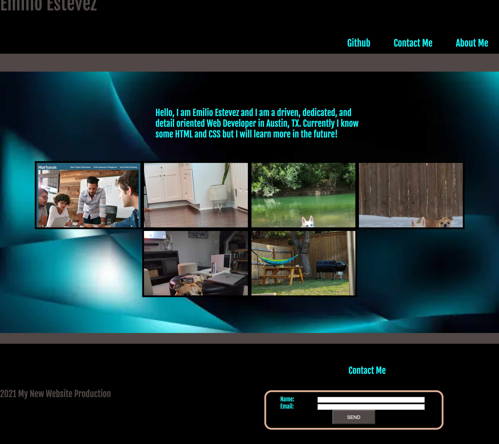

# About:

## This is a Portfolio that showcased all of the projects I have done. Unfortunatly I have only done one project so far so the reast of the photos are of my dogs! I hope you enjoy!

# My Process:

## My process going through this project was a relativly difficult one. I had to really understand how the Parent-child element structure work and it how ot affects the page. Once I figured out how to manipulate child elements with parent elements using classes and divs, it become much easier. 

## Also a struggle was with the padding and margin of the different elements which I couldn't get just right. I will get better in the future, I promise!

## Thank you for reading my Readme and if you would lke to see more fun stuff, please go to my Github page: [Emilio's Github](https://github.com/Emilio512).

## Link to webpage
## [Portfolio](https://github.com/Emilio512/Homework-2-Portfolio) ##

 